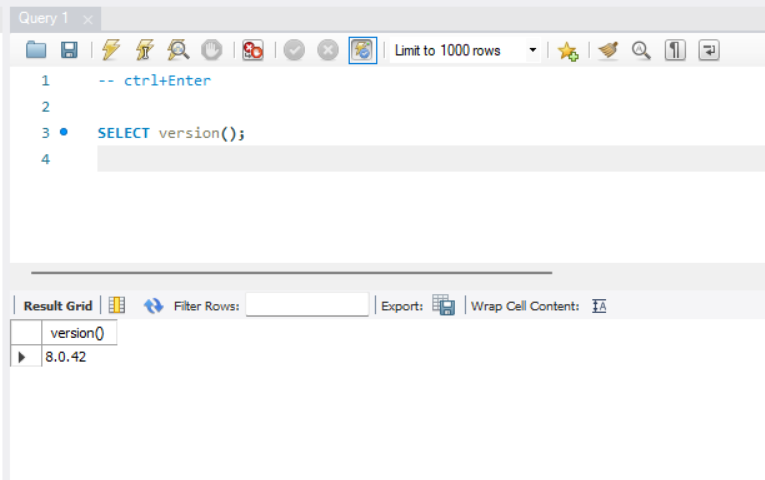

### version 확인

### SQL(구조적 쿼리 언어)
- 관계형 데이터베이스 정보를 저장, 처리하기 위한 프로그래밍 언어
- 관계형 데이터베이스는 표 형식으로 저장
- 행과 열은 다양한 데이터 속성과 데이터 값 간의 다양한 관계 표시
### SQL이 중요한 이유
#### 구조적 쿼리 언어- 모든 유형의 애플리케이션에서 자주 사용되는 널리 사용되는 쿼리 언어
### SQL 시스템의 구성 요소
- 관계형 데이터베이스 관리 시스템-> 구조적 쿼리 언어 사용->데이터 저장, 관리
- 이 시스템은 서로 관련된 여러 데이터베잇 테이블 저장
---
### SQL 테이블
- 관계형 데이터베이스의 기본 요소
- SQL 데이터베이스 테이블은 행과 열로 구성
- 데이터베이스 엔지니어->여러 데이터베이스 테이블 간의 관계를 생성하여 데이터 스토리지 공간을 최적화

---
#### SQL 문 또는 SQL쿼리는 관계형 데이터베이스 관리 시스템에서 이해하는 유효한 명령
## SQL 명령
### 구조적 쿼리 언어 명령
- 관계형 데이터베이스에 저장된 데이터를 조작하는데 사용하는 특정 키워드 또는 SQL 문
#### 데이터 정의 언어(DDL)
---
- 데이터베이스 구조를 설계하는 SQL 명령
- 데이터베이스 엔지니어는 DDL을 사용하여 비즈니스 요구 사항에 따라 데이터 베이스 객체를 만들고 수정

