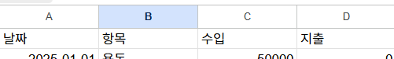
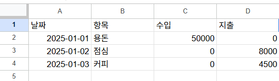
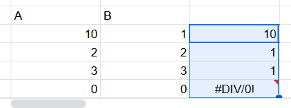
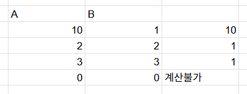

# 스프레드시트 공부
### A,B,C,D 열(COLUMN)
### 1,2,3,4 행(ROW)
 
- HEADER라고 명명
- CRTL+D: 위 복사
- crtl+r: 왼쪽 데이터를 가져온다.
c2:c로 하면 c열에 대한 것을 다 가져온다. 

위 그림을 기준으로 말한 것이다 
- 중요한 것은 값을 보는게 아니라 값을 보는 것
## 많이 나오는 오류 
#### 1.`#DIV/0!`은 0이나 빈칸으로 나눴을때 생기는 오류
#### 2.`#NAME?`은 SUMM과 같이 없는 함수를 만들었을때 생기는 오류
#### 3.`REF?`는 참조가 없는 경우에 생기는 오류
- #DIV/0!을 해결하는 방법 
- **IF(F28=0,"계산불가",E28/F28)로 해서 표현** 
---
### `피벗테이블`이란?
- 복잡한 데이터를 요약, 분석, 비교할 수 있는 강력한 도구
- 수많은 데이터를 직접 일일이 계산하지 않고도, 자동으로 그룹화하거나 합계, 평균, 개수 등을 계산
- 엑셀의 데이터를 드래그&드롭 방식으로 요약, 분석, 시각화할 수 있게 해주는 기능

