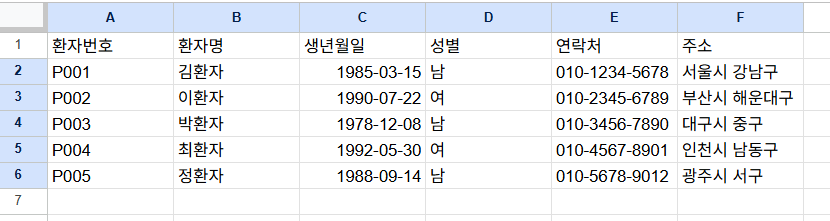
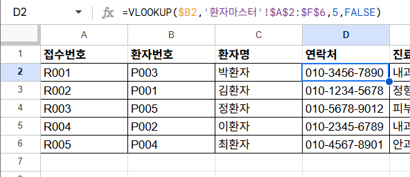

## VLOOKUP 사용법
### VLOOKUP(1,2,3,4)
1. 기준셀
2. 참조 범위
1. 호출할 열 번호
1. 일치 옵션(유사도) 
----

 #### 검색할 값이 입력된 셀을 입력 ->참조할 전체 범위를 지정-> 해당 범위에서 출력할 열의 위치를 번호로 입력-> 찾을 데이터의 일치 옵션 결정

 
- 여기 보면 환자마스터 표에서 5번째 내용인 연락처를 가져와서 출력한다고 보면 된다.