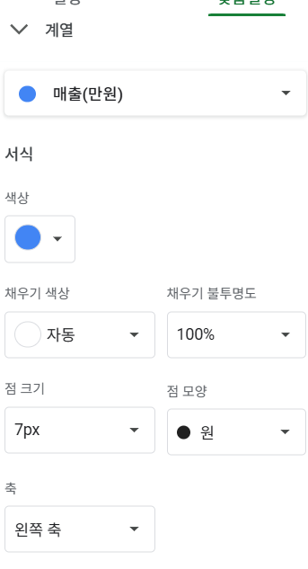
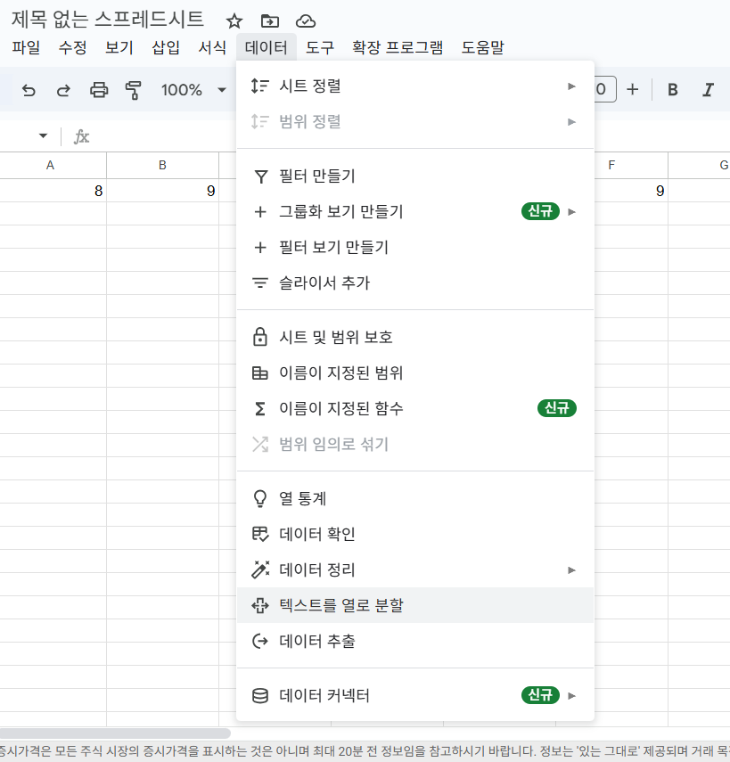

## VLOOKUP 사용법
### VLOOKUP(1,2,3,4)
1. 기준셀
2. 참조 범위
1. 호출할 열 번호
1. 일치 옵션(유사도) 
----

 #### 검색할 값이 입력된 셀을 입력 ->참조할 전체 범위를 지정-> 해당 범위에서 출력할 열의 위치를 번호로 입력-> 찾을 데이터의 일치 옵션 결정

 
- 여기 보면 환자마스터 표에서 5번째 내용인 연락처를 가져와서 출력한다고 보면 된다.
---
### R^2은 결정계수라고 부르는데 독립변수와 종속변수의 관계를 얼마나 잘 설명해주는지를 설명
상관정도를 결정계수를 설명할 수 있다. R^2=0.85가 85%를 설명할 수 있다. 종속변수를 얼마만큼 설명해줄 수 있는지를 알려준다.
15%를 결정한다. 쇼핑몰 매출은 
시간이 매출 증가를 95%정도 설명을 하고 있다. 시간이 95%정도를 차지한다고 볼 수 있다.  
R^2은 숫자 나온것이 0.95보다 높으면 믿을 수 있다. 0.3미만이면 별로 영향을 미치지 않는다고 보면 된다. R^2가 높으면 인과관계
스위스와 초콜릿 얘기 
상관관계와 인과관계와 헷갈려하지 말자
 R^2가 낮으면 관계가 없는 것이 아니다. 주식을 예측하는 것을 0.02는 주식 관련해서 참고할 만한 사항이다. 상관관계도 아니다. 별거아니라고 생각할 수 있다. 
## 회귀분석
- 예측의 점수니깐 의미가 있다. 예측 모델의 적합도가 얼마나 되는지를 말한다. 
- 
---
